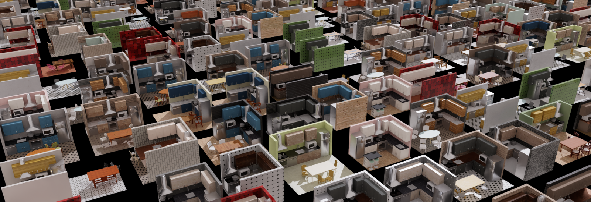

[](https://pypi.org/project/scene-synthesizer/)
[](https://scene-synthesizer.github.io/)
[](https://doi.org/10.21105/joss.07561)

# scene_synthesizer



A python package to generate manipulation scenes.
Check the [documentation](https://scene-synthesizer.github.io/) page for detailed installation instructions, API, and examples.

## Installation

This project will download and install additional third-party open source software projects. Review the license terms of these open source projects before use (e.g. [OpenUSD license](https://openusd.org/license>)).

### Via pip
```
pip install scene-synthesizer[recommend]
```

### Via git
```
# create and activate conda env or venv
git clone https://github.com/NVlabs/scene_synthesizer.git
cd scene_synthesizer/
pip install -e.[recommend]
```
See the [documentation](https://scene-synthesizer.github.io/getting_started/install.html) for detailed installation instructions.

## Quick Start

```python
import scene_synthesizer as synth
import scene_synthesizer.procedural_assets as pa

# create procedural assets
table = synth.procedural_assets.TableAsset(width=1.2, depth=0.8, height=0.75)
cabinet = synth.procedural_assets.CabinetAsset(width=0.5, height=0.5, depth=0.4, compartment_mask=[[0], [1]], compartment_types=['drawer','drawer'])

# load asset from file
# Make sure to first download the file:
# wget https://raw.githubusercontent.com/clemense/kitchen-assets-cc-by/refs/heads/main/assets/chair/meshes/chair.{mtl,obj}
chair = synth.Asset('chair.obj', up=(0, 0, 1), front=(-1, 0, 0))

# create scene
scene = synth.Scene()

# add table to scene
scene.add_object(table)
# put cabinet next to table
scene.add_object(cabinet, connect_parent_anchor=('right', 'front', 'bottom'), connect_obj_anchor=('left', 'front', 'bottom'))
# put chair in front of table
scene.add_object(chair, connect_parent_id='table', connect_parent_anchor=('center', 'front', 'bottom'), connect_obj_anchor=('center', 'center', 'bottom'))

# randomly place plate and glass on top of table
scene.label_support('table_surface', obj_ids='table')
scene.place_object('plate', synth.procedural_assets.PlateAsset(), support_id='table_surface')
scene.place_object('glass', synth.procedural_assets.GlassAsset(), support_id='table_surface')

# preview scene in an opengl window
scene.show()

# export scene in various formats
scene.export('scene.usd')
scene.export('scene.urdf')
```

## License

The code is released under the [Apache-2.0 license](https://github.com/NVlabs/scene_synthesizer/blob/main/LICENSE).


## Contributions

Found a bug? Help us by reporting it! Want a new feature? Create an issue! Made something useful or fixed a bug? Start a PR! Check the [contribution guidelines](CONTRIBUTING.md).

## How can I cite this library?

```
@article{Eppner2024, 
    title = {scene_synthesizer: A Python Library for Procedural Scene Generation in Robot Manipulation}, 
    author = {Clemens Eppner and Adithyavairavan Murali and Caelan Garrett and Rowland O'Flaherty and Tucker Hermans and Wei Yang and Dieter Fox},
    journal = {Journal of Open Source Software}
    publisher = {The Open Journal}, 
    year = {2024},
}
```
